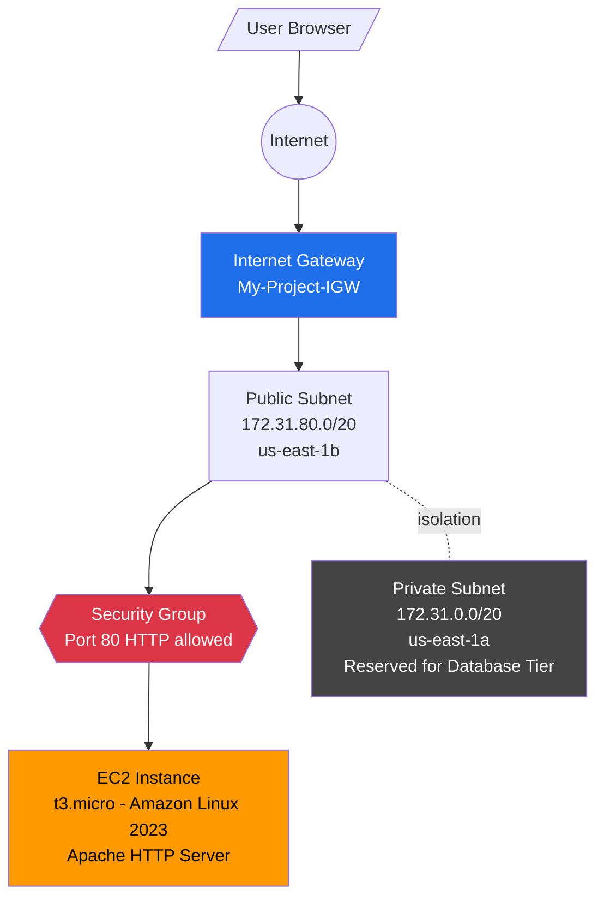
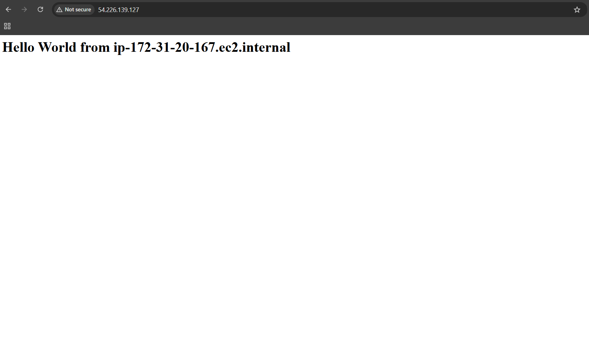
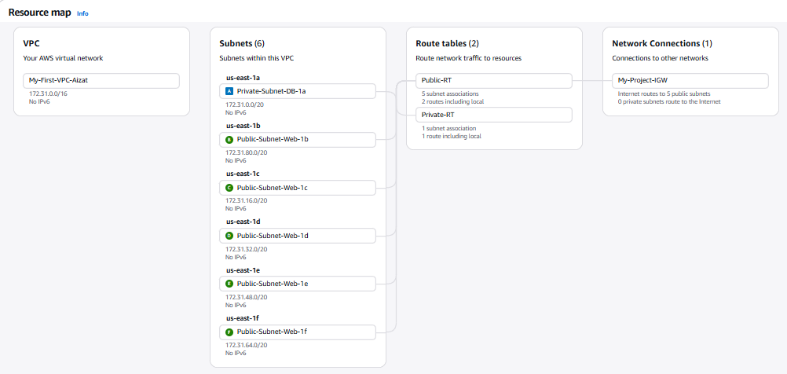

# Automated Web Server Deployment on a Custom VPC

> **Master Capstone Project** — End-to-end deployment workflow integrating Linux Bash automation with AWS network architecture. Combines foundational skills from LPI Linux Essentials and AWS Certified Cloud Practitioner into a unified production-ready design.

---

## 📋 Project Overview

This master project documents the **integrated architecture** for deploying a web server within a custom Virtual Private Cloud — the kind of workflow performed daily by Cloud and DevOps engineers in production environments.

The project consolidates two foundational competencies built during AWS CCP preparation:

1. **Apache Web Server provisioning on EC2** with fully automated Bash bootstrapping via User Data (no SSH required)
2. **Custom multi-subnet VPC design** with public/private isolation, Internet Gateway, and proper route table architecture

Together, they form the canonical "compute + networking + security" pattern that underpins virtually every AWS workload.

---

## 🎯 Integrated Skills Demonstrated

| Domain | Concepts Applied |
|--------|------------------|
| **AWS Networking** | Custom VPC, public/private subnets, Internet Gateway, route tables, CIDR planning |
| **AWS Compute** | EC2 instance provisioning, AMI selection (Amazon Linux 2023), instance type sizing (t3.micro Free Tier) |
| **AWS Security** | Security Groups (Port 80 HTTP allow-list), principle of least exposure |
| **Linux Administration** | Service management (`systemctl`), package installation (`yum`), file system operations |
| **Bash Automation** | User Data scripts, command substitution, I/O redirection |
| **DevOps Mindset** | Infrastructure-as-Code thinking, no-SSH provisioning, repeatable deployment patterns |

---

## 🏗️ Architecture Diagram

The architecture follows a classic **2-tier topology** — a public web tier accessible from the internet, and a private data tier isolated from inbound internet traffic. This is the foundational pattern for hosting web applications, microservices, and three-tier architectures on AWS.

---

## 🌐 Network Design

**VPC:** `My-First-VPC-Aizat` (`172.31.0.0/16`)

| Subnet Name | CIDR | AZ | Type | Purpose |
|-------------|------|-----|------|---------|
| Private-Subnet-DB-1a | 172.31.0.0/20 | us-east-1a | Private | Reserved for database tier |
| Public-Subnet-Web-1b | 172.31.80.0/20 | us-east-1b | Public | Web server deployment |
| Public-Subnet-Web-1c | 172.31.16.0/20 | us-east-1c | Public | Future expansion |
| Public-Subnet-Web-1d | 172.31.32.0/20 | us-east-1d | Public | Future expansion |
| Public-Subnet-Web-1e | 172.31.48.0/20 | us-east-1e | Public | Future expansion |
| Public-Subnet-Web-1f | 172.31.64.0/20 | us-east-1f | Public | Future expansion |

**Route Tables:**
- `Public-RT` → routes `0.0.0.0/0` to `My-Project-IGW`, associated with all public subnets
- `Private-RT` → no internet route, isolating the private subnet from external access

---

## 📜 The Bash Bootstrapping Script

Deployed via EC2 **User Data** — runs automatically on first boot, with no SSH or manual configuration required.

    #!/bin/bash
    yum update -y
    yum install -y httpd
    systemctl start httpd
    systemctl enable httpd
    echo "<h1>Hello World from $(hostname -f)</h1>" > /var/www/html/index.html

### Script Breakdown

| Line | Purpose |
|------|---------|
| `#!/bin/bash` | Specifies the Bash interpreter — required for User Data scripts |
| `yum update -y` | Refreshes package metadata; `-y` auto-accepts prompts (essential for unattended boot) |
| `yum install -y httpd` | Installs Apache HTTP Server from Amazon Linux repositories |
| `systemctl start httpd` | Activates the Apache service immediately |
| `systemctl enable httpd` | Configures Apache to launch automatically on subsequent reboots |
| `echo "..." > index.html` | Generates a dynamic landing page with the instance's internal hostname |
| `$(hostname -f)` | Command substitution — embeds the live FQDN into the response |

**Why automation matters here:** A SysAdmin doing this manually would need to SSH in, install Apache, configure it, and create the page — every single time. With User Data, this entire flow becomes a 5-line script that scales to 1 instance or 10,000.

---

## ⚙️ Deployment Workflow

### 1. Provision the VPC

Built `My-First-VPC-Aizat` with CIDR `172.31.0.0/16`, including:
- 6 subnets distributed across multiple Availability Zones
- 1 Internet Gateway (`My-Project-IGW`) attached to the VPC
- 2 Route Tables (Public-RT and Private-RT) with appropriate associations

### 2. Configure Security Group

Created a Security Group with explicit inbound rules:
- **Port 80 (HTTP)** — allowed from `0.0.0.0/0` for public web access
- **All other ports** — denied by default (AWS Security Groups are deny-by-default)

### 3. Launch EC2 Instance

- **AMI:** Amazon Linux 2023
- **Instance type:** t3.micro (Free Tier eligible)
- **Subnet:** Public-Subnet-Web-1b
- **Auto-assign Public IP:** Enabled
- **Security Group:** Web-SG (created above)
- **User Data:** The Bash script above

### 4. Verify

Access the public IP via a web browser. The User Data script bootstraps Apache, and the page renders without manual intervention.

---

## ✅ Evidence of Execution

### Web Server Live on Public IP

**Public IP:** `54.226.139.127`
**Internal Hostname:** `ip-172-31-20-167.ec2.internal`
**Result:** Apache HTTP Server bootstrapped successfully via User Data, serving a dynamic page containing the instance's internal hostname.

### Custom VPC Resource Map

VPC `My-First-VPC-Aizat` showing the complete network topology — 6 subnets, 2 route tables, and Internet Gateway integration confirming the network foundation is correctly provisioned.

---

## 🔐 Security Considerations

- **Defense in depth:** The Security Group acts as a stateful firewall at the instance level, complementing subnet-level Network ACLs.
- **Principle of least exposure:** Only Port 80 is reachable from the internet. SSH (Port 22) is intentionally not opened — User Data eliminates the need for SSH-based provisioning.
- **Private tier reservation:** The `Private-Subnet-DB-1a` is intentionally cordoned off from internet access, preparing the architecture for adding a backend database (RDS or self-managed) without requiring re-architecting.
- **No hardcoded secrets:** The bootstrap script contains no credentials or keys. In production, IAM Instance Profiles would handle any required AWS API access.

---

## 💡 Lessons Learned

- **User Data eliminates configuration drift.** Manual SSH-based setup leads to "it works on my server" problems. Automated bootstrapping makes every instance identical and reproducible.
- **Subnet purpose is determined by routing, not naming.** A subnet only becomes "public" when its associated route table has a `0.0.0.0/0` route to an Internet Gateway. The name is documentation; the routing is reality.
- **Security Groups are stateful.** Allowing Port 80 inbound automatically allows the response traffic outbound. This differs from Network ACLs, which are stateless.
- **`hostname -f` provides a live identity.** Embedding it in the index page makes troubleshooting in load-balanced fleets dramatically easier — you can immediately see which instance served a request.
- **Architecture is more durable than implementation.** The same network design serves whether the workload is Apache, Nginx, Tomcat, or a Node.js application. Investing in the network architecture pays compound returns.

---

## 🔮 Future Improvements

- **Application Load Balancer (ALB)** in front of multiple EC2 instances across both public subnets for true high availability
- **Auto Scaling Group** with the User Data script as the launch template — turns this into a self-healing, elastic fleet
- **RDS deployment in the private subnet** to demonstrate the full 2-tier pattern with database isolation
- **Route 53 + ACM** for a custom domain name with TLS/HTTPS termination at the load balancer
- **Conversion to Terraform** — reproduce this entire architecture as version-controlled Infrastructure as Code
- **CloudWatch Logs integration** — stream Apache access and error logs for centralized observability

---

## 👤 Author

**Khairul Aizat**
Aspiring Cloud & Linux Operations Engineer | KL, Malaysia

- LinkedIn: [linkedin.com/in/aizat-linux](https://www.linkedin.com/in/aizat-linux)
- AWS Certified Cloud Practitioner (CLF-C02)
- LPI Linux Essentials — High Distinction (750/800)

**Related Repositories:**
- [Linux Server Provisioning & Audit System](https://github.com/aizat-cloud/linux-server-audit-system)
- [Resilient Multi-AZ VPC Architecture](https://github.com/aizat-cloud/resilient-aws-vpc-architecture)

---

> *"The mark of a senior engineer isn't writing more code — it's designing systems where less code does more work."*
